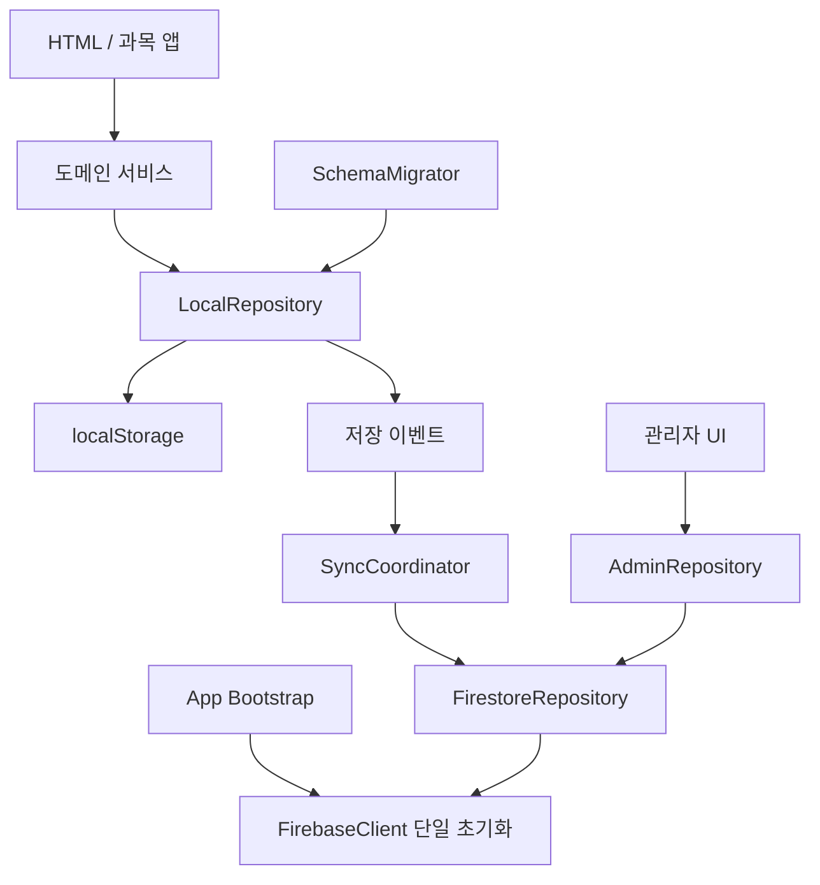

# Smart Study 계층·마이그레이션·API 정리 계획

작성일: 2026-07-30
대상 기준 커밋: `46b17aa`
목표: 레이어를 우회하는 저장 함수, 버전 없는 데이터 변경, 중복 외부 API 접점을 제거하고 이후 재발을 자동 검사한다.

## 구현 상태

2026-07-30 기준으로 이 계획은 코드에 적용되었다.

- 공통 저장 키·LocalRepository·저장 이벤트 구현 완료
- 사용자·보고서·오답·타이머 설정의 버전 마이그레이션 구현 완료
- Firebase 저장 함수 monkey patch 제거 완료
- Firebase SDK와 Firestore CRUD 단일화 완료
- 관리자 직접 Firestore 접근 제거 완료
- 카카오 SDK 전송 호출 단일화 완료
- 수학 공식 퀴즈 generator registry 적용 완료
- 중복 스크립트와 서비스 워커 누락 자산 수정 완료
- GitHub Pages 배포 전 전체 테스트 실행 단계 추가 완료
- 아키텍처 경계·마이그레이션 자동 검사 추가 완료

## 1. 판정 기준

이 프로젝트는 정적 GitHub Pages 앱으로, 백엔드 애플리케이션 서버나 ORM은 없다. 따라서 요청한 세 항목을 현재 구조에 맞게 다음처럼 해석한다.

| 요청 항목 | 이 프로젝트의 대응 개념 |
|---|---|
| 기존 레이어를 무시하는 함수 | UI/과목 코드가 저장소를 직접 읽고 쓰는 행위, 동기화 모듈이 기존 함수를 런타임에 덮어쓰는 행위 |
| ORM 관례 무시 마이그레이션 | localStorage·Firestore 문서 스키마를 버전·순서·롤백·멱등성 없이 암묵적으로 변경하는 행위 |
| 중복된 API 포인트 | Firebase SDK 중복 초기화, 여러 파일의 Firestore 직접 접근, 카카오 공유 호출 반복, 같은 스크립트 중복 로드 |

완료 상태는 다음 조건을 만족해야 한다.

1. 저장·조회는 명시적인 저장소 인터페이스를 통과한다.
2. 원격 동기화는 함수 monkey patch가 아니라 저장 이벤트를 구독한다.
3. 모든 영속 데이터에는 스키마 버전과 순차·멱등 마이그레이션이 있다.
4. Firebase 초기화와 Firestore 경로 생성은 한 모듈만 담당한다.
5. 카카오 공유 전송은 한 내부 함수만 SDK를 호출한다.
6. HTML에 동일 외부 스크립트가 중복 선언되지 않는다.
7. 아키텍처 감사 스크립트와 기존 테스트가 모두 통과한다.

## 2. 조사 결과

### 2.1 기존 레이어를 우회하는 함수

#### A. Firebase 동기화가 핵심 저장 함수를 런타임에 교체함

`firebase-sync.js`의 `_patchSaveFunctions()`가 다음 함수를 직접 덮어쓴다.

- `UserSession.saveUserData`
- `window.saveQuizResult`
- `WrongNote.save`
- `WrongNote.remove`

원래 함수를 보관한 뒤 실행하고 원격 업로드를 추가하므로 현재 기능은 동작하지만, 다음 문제가 있다.

- 스크립트 로드 순서에 따라 패치 적용 여부가 달라진다.
- 함수 참조를 패치 전에 보관한 모듈은 동기화를 우회할 수 있다.
- 테스트가 원래 함수인지 패치된 함수인지 구분하기 어렵다.
- 저장 도메인 로직이 동기화 전송 책임까지 간접적으로 떠안는다.
- 새 저장 메서드가 생기면 패치 목록에 수동 추가해야 한다.

판정: **제거 대상**

#### B. UI 페이지가 localStorage를 직접 조작함

직접 접근이 확인된 주요 위치:

- `stats.html`: 보고서 직접 조회
- `report.html`: 공유 기록 직접 병합·저장
- `ReadingApp.js`: 최근 지문 직접 저장
- `MathFormulaApp.js`: 필터 설정 직접 저장
- `index.html`, `ui-core.js`: 전체 `localStorage.clear()`

최근 지문·필터 같은 UI preference는 경량 저장소로 분리하면 허용할 수 있다. 그러나 보고서·사용자·오답 같은 도메인 데이터는 공통 저장 계층을 거쳐야 한다.

판정: **도메인 데이터 직접 접근은 제거, UI preference는 전용 저장소로 격리**

#### C. 관리자 화면이 Firestore를 직접 조회·수정함

`admin.html`이 Firebase 초기화 fallback과 아래 작업을 직접 수행한다.

- 전체 사용자 조회
- 사용자·reports·wrongAnswers 상세 조회
- 보상 사용 처리
- 관리자 학습 시간 설정 저장

`firebase-sync.js`도 같은 `users` 컬렉션 경로를 만든다. 화면 계층이 원격 데이터 구조를 알고 있어 Firestore 문서 구조를 바꾸면 여러 파일을 함께 수정해야 한다.

판정: **원격 저장소 모듈로 이동**

#### D. 수학 공식 퀴즈가 전역 API를 연속 교체함

로드 순서:

1. `MathFormulaQuiz.js`가 `window.MathFormulaQuiz` 생성
2. `MathFormulaQuizExtra.js`가 기존 객체를 잡고 새 객체로 교체
3. `MathFormulaQuizVolume2.js`가 다시 기존 객체를 잡고 새 객체로 교체

이것은 의도적인 기능 확장이지만 전역 덮어쓰기 방식이라 파일 누락·순서 변경에 취약하다.

판정: **명시적 generator registry로 교체**

#### E. 수학 단원 퀴즈 데이터의 전역 교체

`MathQuizMiddle1.js`, `MathQuizMiddle1Semester2.js`는 각각 `window.MathQuizData`를 설정한다. 현재 페이지가 필요한 파일 하나만 선택해 로드하는 조건에서는 충돌하지 않지만, 동일 페이지에 함께 로드하면 마지막 파일이 승리한다.

판정: **레벨/학기 키 기반 registry로 통합**

### 2.2 ORM 관례를 무시하는 마이그레이션

전통적인 ORM과 DB migration 파일은 **없다**. 따라서 “ORM 관례를 어긴 migration”도 문자 그대로는 없다.

하지만 다음의 암묵적 스키마 변경이 사실상 마이그레이션 역할을 한다.

- `getUserData()`가 누락 필드에 기본값을 붙임
- 기간이 바뀌면 daily/weekly/monthly 데이터를 읽는 시점에 초기화
- `StudyTimer.getConfig()`가 예전 과목 단위 설정을 레벨 설정의 fallback으로 사용
- Firebase 병합기가 신·구 필드를 큰 값·긴 배열 기준으로 합침
- `formulaStudyTime`, `monthlyStats`, mission reward 등 신규 필드가 기존 문서에 점진적으로 추가됨

현재 영속 객체에 공통 `schemaVersion`이 없고, migration registry, 완료 기록, 검증, 실패 복구가 없다. 이 방식은 필드 추가에는 버틸 수 있지만 이름 변경·타입 변경·필드 분리에는 취약하다.

판정: **명시적인 비-ORM 스키마 마이그레이션 계층 필요**

### 2.3 중복 API 포인트

#### 확인된 중복

1. Firebase SDK 초기화
   - `firebase-sync.js`
   - `admin.html` fallback

2. Firestore `users` 경로 접근
   - `firebase-sync.js`
   - `admin.html`에서 직접 6개 지점

3. 카카오 공유 SDK 호출
   - `kakao-share.js`에서 `Kakao.Share.sendDefault()` 네 번 반복

4. 버전 확인 스크립트 중복 로드
   - `wrong_note.html`에 `version-check.js` 두 번 선언

5. 데이터 조회 API 중복
   - `stats.html`이 localStorage 보고서를 직접 파싱
   - 다른 화면은 `getQuizReports()` 사용

#### 중복이 아닌 것

- 각 수학 페이지의 KaTeX CDN 선언은 서로 다른 HTML 진입점이므로 런타임 중복 호출이 아니다.
- `admin.html`과 `stats.html`의 Chart.js 선언도 서로 다른 페이지이므로 정상이다.
- Firebase의 public web config가 두 파일에 반복된 것은 초기화 중복의 증상이며, 별도의 서버 API endpoint 중복은 아니다.

## 3. 목표 구조

대규모 프레임워크를 추가하지 않고 현재 정적 앱에 맞는 작은 계층을 둔다.



최소 신규 모듈:

| 모듈 | 책임 |
|---|---|
| `storage-keys.js` | 모든 키 생성과 prefix 관리 |
| `local-repository.js` | 사용자·보고·오답·설정·preference 읽기/쓰기 |
| `storage-events.js` | 저장 후 이벤트 발행·구독 |
| `schema-migrations.js` | 순차·멱등 데이터 변환 |
| `firebase-client.js` | Firebase SDK 단일 로드·초기화 |
| `firestore-repository.js` | Firestore 문서 경로와 CRUD |
| `sync-coordinator.js` | 다운로드·병합·debounce 업로드 |
| `quiz-registry.js` | 수학 단원/공식 generator 명시적 등록 |

ES module 전환은 이번 최적화의 필수 조건으로 두지 않는다. 기존 script 순서를 유지하면서 IIFE와 단일 `window.SmartStudy` namespace로 점진 전환하면 변경 위험이 작다.

## 4. 단계별 실행 계획

### Phase 0. 안전망 고정

목표: 리팩터링 전 현재 동작을 테스트로 고정한다.

작업:

1. 현재 9개 테스트를 CI에서 실행하도록 workflow 추가
2. 아래 아키텍처 감사를 `architecture-boundaries.test.js`로 저장
3. 테스트가 현재 위반을 정확히 검출하는지 먼저 확인
4. 이후 Phase마다 위반 허용 목록을 줄임

실행:

```powershell
$tests = Get-ChildItem -File -Filter *.test.js | Sort-Object Name
foreach ($test in $tests) {
    node $test.FullName
    if ($LASTEXITCODE -ne 0) { exit $LASTEXITCODE }
}
```

완료 조건:

- 기존 9개 테스트 통과
- 감사 테스트가 현재 위반 위치를 파일·줄 번호와 함께 출력

### Phase 1. 저장 키와 LocalRepository 도입

목표: 도메인 localStorage 접근을 한 계층으로 모은다.

작업:

1. `storage-keys.js`에 다음 키 함수를 정의
   - active user
   - user data
   - reports
   - wrong answers
   - timer config/time/scores
   - UI preferences
2. `local-repository.js`에 안전한 JSON parse, 기본값, 원자적 read-modify-write 구현
3. `report.js`, `study-timer.js`부터 repository 사용으로 변경
4. `stats.html`, `report.html`의 보고서 직접 조회를 `QuizReportRepository.list()`로 교체
5. Reading 최근 지문과 공식 필터는 `PreferenceRepository`로 이동
6. 전체 삭제는 `clearAppData()`로 교체하여 `SmartStudy_`, `SmartVocab_`, `MathFormula_` 키만 제거

예상 인터페이스:

```js
window.SmartStudy = window.SmartStudy || {};

SmartStudy.LocalRepository = {
    getUser(userId) {},
    saveUser(user) {},
    listReports(userId) {},
    saveReports(userId, reports) {},
    getWrongAnswers(userId) {},
    saveWrongAnswers(userId, data) {},
    getPreference(name, fallback) {},
    setPreference(name, value) {},
    clearAppData() {}
};
```

완료 조건:

- UI 파일에서 도메인 키 문자열 직접 사용 0건
- `localStorage.clear()` 0건
- localStorage 직접 접근은 `local-repository.js`와 저수준 timer 저장소 등 허용 파일에만 존재

### Phase 2. 함수 monkey patch 제거

목표: Firebase 동기화가 도메인 함수를 덮어쓰지 않게 한다.

작업:

1. `storage-events.js`에 `subscribe(event, handler)`와 `publish(event, payload)` 구현
2. repository가 성공적으로 저장한 뒤 아래 이벤트 발행
   - `user:saved`
   - `reports:saved`
   - `wrongAnswers:saved`
   - `config:saved`
3. `sync-coordinator.js`가 이벤트를 구독하고 기존 2초 debounce 업로드 실행
4. `_patchSaveFunctions()` 전체 제거
5. 페이지 load 순서와 무관하게 bootstrap 단계에서 구독 한 번만 수행
6. 이벤트 handler 실패가 로컬 저장 성공을 되돌리지 않도록 분리

예상 코드:

```js
StorageEvents.subscribe('reports:saved', ({ userId }) => {
    SyncCoordinator.schedule(`reports:${userId}`, () => {
        return FirestoreRepository.uploadReports(userId);
    });
});
```

완료 조건:

- `UserSession.saveUserData = function` 같은 런타임 재할당 0건
- `window.saveQuizResult` 재할당 0건
- `WrongNote.save/remove` 재할당 0건
- 오프라인 저장 후 온라인 재접속 동기화 유지

### Phase 3. 명시적 스키마 마이그레이션

목표: ORM이 없는 정적 앱에서도 관례적인 순차·멱등 migration을 보장한다.

관례:

1. 각 영속 root에 정수 `schemaVersion`
2. migration은 `vN -> vN+1` 한 단계씩만 수행
3. 같은 입력에 여러 번 실행해도 결과가 같아야 함
4. 원본을 직접 변경하지 않고 복사본 반환
5. migration 후 schema validation
6. 저장 전 `{key}.backup.{timestamp}` 임시 백업
7. 성공 후에만 원래 키 교체
8. 로컬과 원격 데이터를 각각 migrate한 뒤 merge
9. 배포 후 최소 한 버전 동안 하위 호환 reader 유지

초기 버전 제안:

```js
const CURRENT_SCHEMA_VERSION = 3;

const migrations = {
    0: data => ({ ...data, schemaVersion: 1 }),
    1: data => ({
        ...data,
        monthlyStats: data.monthlyStats || createMonthlyStats(),
        schemaVersion: 2
    }),
    2: data => ({
        ...data,
        formulaStudyTime: normalizeFormulaTime(data.formulaStudyTime),
        schemaVersion: 3
    })
};

function migrateUserData(input) {
    let data = structuredClone(input || {});
    let version = Number.isInteger(data.schemaVersion) ? data.schemaVersion : 0;
    while (version < CURRENT_SCHEMA_VERSION) {
        const migrate = migrations[version];
        if (!migrate) throw new Error(`Missing migration v${version}`);
        data = migrate(data);
        version = data.schemaVersion;
    }
    validateUserData(data);
    return data;
}
```

별도 버전이 필요한 저장 객체:

- user data
- quiz reports
- wrong answers
- study timer config
- adaptive score store

완료 조건:

- 모든 root 영속 데이터에 `schemaVersion`
- 빈 데이터, 현재 데이터, 구버전 fixture migration 통과
- migration 2회 적용 결과 동일
- 미래 버전 데이터는 덮어쓰지 않고 명확한 오류 또는 읽기 전용 처리

### Phase 4. Firebase API 단일화

목표: SDK 초기화·경로·CRUD를 화면에서 제거한다.

작업:

1. Firebase config와 SDK loader를 `firebase-client.js` 한 곳으로 이동
2. 동시 초기화 호출은 같은 Promise를 반환
3. `firestore-repository.js`에서만 `collection()`과 `doc()` 사용
4. 관리자용 메서드 추가
   - `listLearners()`
   - `getLearnerDetail(userId)`
   - `markRewardUsed(userId, period)`
   - `saveStudyTimeConfig(config)`
5. `admin.html`의 Firebase fallback과 직접 CRUD 제거
6. `firebase-sync.js`는 `SyncCoordinator`와 repository 호출만 담당하도록 축소

예상 인터페이스:

```js
const FirestoreRepository = {
    getUser(userId) {},
    putUser(userId, data) {},
    getReports(userId) {},
    putReports(userId, reports) {},
    getWrongAnswers(userId) {},
    putWrongAnswers(userId, wrongAnswers) {},
    listLearners() {},
    saveAdminConfig(config) {}
};
```

완료 조건:

- `collection(`, `doc(` 호출은 `firestore-repository.js`에만 존재
- Firebase config 정의 1건
- Firebase SDK URL 정의 1세트
- 관리자와 학습자 동기화가 같은 client Promise 사용

### Phase 5. 카카오 공유 API 중복 제거

목표: SDK 직접 호출과 URL 생성·오류 처리를 공통화한다.

작업:

1. `KakaoShare._sendFeed({ title, description, imageUrl, url, buttonTitle })` 추가
2. `sendRequest`, `sendReport`, `sendDailySummary`, `sendFullHistory`는 payload만 생성
3. SDK 준비 Promise를 만들고 초기화 중 호출은 기다리도록 변경
4. base URL 생성 함수 통합
5. payload URL 길이 검사와 초과 시 안내 추가

완료 조건:

- `Kakao.Share.sendDefault` 호출 1건
- Kakao SDK URL 1건
- 공통 오류 처리 1건

### Phase 6. 퀴즈 전역 덮어쓰기 제거

목표: 로드 순서가 아니라 명시적 등록으로 문항 생성기를 합성한다.

작업:

1. `QuizRegistry.registerFormula(number, generator)` 도입
2. 공식 1~10, 11~30, 31~60 파일은 generator만 등록
3. `MathFormulaQuiz.create(number)`는 registry에서 조회
4. `QuizRegistry.registerMath({ level, semester, unit }, generator)` 도입
5. 중1 1/2학기 데이터의 `window.MathQuizData` 교체 제거
6. 중복 키 등록 시 즉시 오류

예상 코드:

```js
QuizRegistry.registerFormulaRange({
    source: 'MathFormulaQuizExtra.js',
    generators: {
        11: createFormula11Quiz,
        12: createFormula12Quiz
    }
});
```

완료 조건:

- `window.MathFormulaQuiz =`는 public facade 생성 1건만 존재
- `window.MathQuizData =`는 public facade 생성 1건만 존재
- 1~60 공식 생성기 누락·중복 0건
- 기존 랜덤성·정답·선택지 고유성 테스트 통과

### Phase 7. HTML 중복과 bootstrap 정리

작업:

1. `wrong_note.html`의 중복 `version-check.js` 한 줄 제거
2. 공통 스크립트 순서를 문서화
3. 각 페이지 진입 시 `SmartStudy.bootstrap({ page })` 한 번 실행
4. 동일 script src 중복 감사 자동화
5. 서비스 워커 선캐시 파일 존재 검사도 같은 감사 스크립트에 포함

완료 조건:

- 페이지별 동일 script src 중복 0건
- 전역 초기화 함수가 idempotent
- 누락된 선캐시 파일 0건

## 5. 자동 감사 스니펫

다음 파일을 `architecture-boundaries.test.js`로 추가한다. CI와 로컬에서 실행 가능하고 외부 패키지가 필요 없다.

```js
const assert = require('node:assert/strict');
const fs = require('node:fs');
const path = require('node:path');

const root = __dirname;
const files = fs.readdirSync(root)
    .filter(name => /\.(js|html)$/.test(name) && !name.endsWith('.test.js'));
const read = file => fs.readFileSync(path.join(root, file), 'utf8');

function matches(pattern) {
    return files.flatMap(file => {
        const lines = read(file).split(/\r?\n/);
        return lines.flatMap((line, index) =>
            pattern.test(line) ? [`${file}:${index + 1}`] : []
        );
    });
}

const allowedLocalStorage = new Set([
    'local-repository.js',
    'schema-migrations.js'
]);

const directStorage = files.filter(file =>
    /localStorage\.(getItem|setItem|removeItem|clear)/.test(read(file))
    && !allowedLocalStorage.has(file)
);
assert.deepEqual(directStorage, [], `Direct localStorage access: ${directStorage}`);

const monkeyPatches = matches(
    /(?:UserSession\.saveUserData|WrongNote\.(?:save|remove)|window\.saveQuizResult)\s*=/
);
assert.deepEqual(monkeyPatches, [], `Runtime save-function patch: ${monkeyPatches}`);

const firestoreOutsideRepository = files.filter(file =>
    /\.(collection|doc)\(/.test(read(file))
    && file !== 'firestore-repository.js'
);
assert.deepEqual(
    firestoreOutsideRepository,
    [],
    `Direct Firestore access: ${firestoreOutsideRepository}`
);

const kakaoCalls = matches(/Kakao\.Share\.sendDefault\(/);
assert.equal(kakaoCalls.length, 1, `Kakao API call count: ${kakaoCalls}`);

for (const file of files.filter(name => name.endsWith('.html'))) {
    const scripts = [...read(file).matchAll(
        /<script[^>]+src=["']([^"']+)["']/g
    )].map(match => match[1].replace(/[?#].*$/, ''));
    const duplicates = scripts.filter((src, index) => scripts.indexOf(src) !== index);
    assert.deepEqual([...new Set(duplicates)], [], `${file}: duplicate scripts`);
}

console.log('Architecture boundaries verified.');
```

주의: Phase 1 진행 중에는 허용 목록에 기존 저수준 파일을 임시로 넣고, 각 Phase가 끝날 때 목록을 줄인다. 처음부터 위 최종 기준을 강제하면 단계적 리팩터링이 불가능하다.

## 6. 마이그레이션 검증 스니펫

`schema-migrations.test.js`에서 최소 다음을 검증한다.

```js
const assert = require('node:assert/strict');
const { migrateUserData, CURRENT_SCHEMA_VERSION } =
    require('./schema-migrations.js');

const legacy = {
    id: 'fixture-user',
    totalStudyTime: 120,
    dailyStats: { date: '2026-07-30', studyTime: {} }
};

const once = migrateUserData(legacy);
const twice = migrateUserData(once);

assert.equal(once.schemaVersion, CURRENT_SCHEMA_VERSION);
assert.deepEqual(twice, once, 'Migration must be idempotent');
assert.equal(legacy.schemaVersion, undefined, 'Input must not be mutated');
assert.ok(once.monthlyStats, 'Required current field is missing');
assert.ok(once.formulaStudyTime, 'Formula time normalization is missing');

console.log('Schema migrations verified.');
```

추가 fixture:

- 완전히 빈 사용자
- monthlyStats 도입 전 사용자
- formulaStudyTime 도입 전 사용자
- 구형 과목 단위 timer config
- history가 없는 구형 wrong answer
- 현재 버전 사용자
- 현재보다 높은 미래 버전 사용자
- 손상된 JSON과 잘못된 타입

## 7. API 중복 검사 스니펫

리팩터링 전후 빠른 현황 확인:

```powershell
@'
const fs = require('fs');
const files = fs.readdirSync('.').filter(name => /\.(js|html)$/.test(name));
const count = pattern => files.flatMap(file => {
    const source = fs.readFileSync(file, 'utf8');
    return [...source.matchAll(pattern)].map(() => file);
});

console.log({
    firebaseSdkUrls: count(/firebase-(?:app|firestore)-compat\.js/g),
    firestoreUserPaths: count(/\.collection\(['"]users['"]\)/g),
    kakaoSendCalls: count(/Kakao\.Share\.sendDefault\(/g),
    directStorageCalls: count(/localStorage\.(?:getItem|setItem|removeItem|clear)/g)
});
'@ | node -
```

목표 결과:

- Firebase SDK URL: `firebase-client.js`에 2개 URL만 존재
- Firestore users path: `firestore-repository.js`에만 존재
- Kakao send call: 1건
- 도메인 localStorage call: `local-repository.js`에만 존재

## 8. 테스트·배포 순서

각 Phase는 다음 순서로 진행한다.

1. 관련 회귀 테스트 추가
2. 작은 단위로 코드 변경
3. 해당 테스트 실행
4. 전체 `*.test.js` 실행
5. `architecture-boundaries.test.js` 실행
6. 브라우저 수동 smoke test
7. 별도 commit

필수 브라우저 smoke test:

1. 신규/기존 사용자 로그인
2. 오프라인 상태에서 학습 시간 누적
3. 온라인 복귀 후 Firestore 동기화
4. 각 과목 퀴즈 1회와 오답 재도전
5. 나의 학습·성적표·오답 노트 반영
6. 관리자 사용자 목록·상세·시간 설정
7. 카카오 학습 요청과 결과 공유
8. 구버전 fixture를 넣은 뒤 자동 migration
9. 새로고침·다른 기기 병합 후 데이터 보존

배포 전 실행:

```powershell
git diff --check

$tests = Get-ChildItem -File -Filter *.test.js | Sort-Object Name
foreach ($test in $tests) {
    node $test.FullName
    if ($LASTEXITCODE -ne 0) { exit $LASTEXITCODE }
}
```

## 9. 변경 단위와 권장 커밋

큰 한 번의 리팩터링 대신 다음 순서로 나눈다.

1. `test: add architecture boundary audit`
2. `refactor: centralize local storage access`
3. `refactor: replace sync monkey patches with storage events`
4. `feat: add versioned schema migrations`
5. `refactor: centralize firebase and firestore access`
6. `refactor: deduplicate kakao share endpoint`
7. `refactor: register math quiz generators explicitly`
8. `fix: remove duplicate scripts and verify precache assets`
9. `ci: run repository tests before pages deploy`

각 커밋은 기존 데이터와 호환되어야 하며, migration 도입 전에는 기존 필드 삭제나 이름 변경을 하지 않는다.

## 10. 제외 범위

다음은 이번 목표와 직접 관련이 없어 별도 작업으로 둔다.

- UI 디자인 변경
- 학습 콘텐츠·문항 추가
- Firebase Authentication 도입 자체
- Firestore Security Rules 재설계
- 전체 ES module/TypeScript 전환
- 프레임워크 또는 실제 ORM 도입

단, Firebase 접근 계층을 모으는 것은 이후 인증·Rules 강화의 선행 작업이다.

## 11. 최종 완료 기준

- [ ] 저장 함수 runtime monkey patch 0건
- [ ] 도메인 코드의 직접 localStorage 접근 0건
- [ ] `localStorage.clear()` 0건
- [ ] 모든 영속 root에 `schemaVersion`
- [ ] migration 순차성·멱등성·미래 버전 방어 테스트 통과
- [ ] Firebase 초기화 구현 1곳
- [ ] Firestore 경로/CRUD 구현 1곳
- [ ] `Kakao.Share.sendDefault()` 호출 1건
- [ ] 수학 퀴즈 전역 덮어쓰기 0건
- [ ] HTML 동일 script 중복 0건
- [ ] 서비스 워커 선캐시 누락 파일 0건
- [ ] 기존 9개 테스트 및 신규 감사·migration 테스트 모두 통과
- [ ] GitHub Pages 배포 전 CI가 테스트 실패를 차단

이 순서대로 진행하면 기능을 유지하면서 레이어 우회, 암묵적 데이터 변경, 중복 API 접점을 제거할 수 있다. 핵심은 새로운 대형 프레임워크를 넣는 것이 아니라 저장소·이벤트·마이그레이션·원격 API라는 네 개의 작은 경계를 명확히 만드는 것이다.
