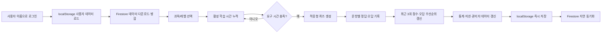

# Smart Study 앱 심층 분석 보고서

작성일: 2026-07-30
분석 대상: `study-app-grammar-m23` 저장소 전체
분석 기준 커밋: `46b17aa` (`agent/stats-quiz-view-fix`)

## 1. 요약

이 저장소는 별도의 서버 렌더링이나 번들 빌드 없이 GitHub Pages에서 실행되는 정적 웹/PWA 학습 앱이다. HTML 진입점마다 필요한 JavaScript 데이터 파일과 공통 모듈을 전역 스코프로 불러오는 구조이며, 브라우저 `localStorage`를 즉시 사용 가능한 주 저장소로 삼고 Firebase Firestore를 기기 간 동기화 및 관리자 조회용 원격 저장소로 사용한다.

앱의 핵심 과목은 다음 다섯 개다.

1. 국어 독해력
2. 영어 단어
3. 영어 문법
4. 한자
5. 수학

수학 공식 사전은 별도 보조 콘텐츠다. 일반 과목의 퀴즈 잠금, 미션, 일반 과목 통계에는 포함되지 않지만 학습·퀴즈 활동 시간은 별도 필드에 기록되어 관리자 대시보드에 표시된다.

전체 흐름은 다음과 같다.



분석 결과 구현 범위는 상당히 넓고, 현재 포함된 9개 테스트는 모두 통과했다. 다만 데이터 정확성·보안·오프라인 동작 측면에서 우선 확인해야 할 위험도 발견됐다.

- 미션의 “80점 이상” 판정에 백분율이 아니라 정답 개수가 전달되는 경로가 있어 사실상 완료되지 않을 가능성이 높다.
- 학습 타이머의 날짜 키는 UTC, 통계·미션의 날짜 키는 한국 현지 시각을 사용하여 자정 부근에 날짜가 어긋날 수 있다.
- 영어 문법 활성 학습 시간은 타이머에서 이미 합산한 뒤 퀴즈 보고 저장 시 다시 합산될 수 있어 중복 집계 가능성이 있다.
- 서비스 워커의 선캐시 목록에 실제로 존재하지 않는 이미지 2개가 들어 있어 설치 단계 전체가 실패할 수 있다.
- Firebase Authentication 없이 사용자가 입력한 이름을 문서 ID처럼 사용하는 구조다. 실제 Firestore 보안 규칙이 엄격하지 않으면 데이터 열람·변조 위험이 크다.

## 2. 저장소 규모와 구성

`node_modules`를 제외하면 총 81개 파일이며, 주요 구성은 JavaScript 46개, HTML 13개, CSS 1개다. 분석 대상 텍스트 파일은 약 22,932줄이다.

가장 큰 파일들은 콘텐츠 데이터와 화면 자체에 로직이 포함된 HTML이다.

| 파일 | 역할 |
|---|---|
| `index.html` | 로그인, 홈 대시보드, 과목 메뉴, 오늘 요약, 미션 |
| `report.js` | 사용자·통계·퀴즈 보고·오답·적응형 출제의 핵심 모델 |
| `firebase-sync.js` | localStorage와 Firestore 간 병합·동기화 |
| `study-timer.js` | 레벨별 퀴즈 잠금 시간, 활성 학습 감지, 최근 3회 점수 |
| `missions.js` | 일간·주간·월간 미션 및 랜덤 보상 |
| `stats.html` | 학습자용 주간 통계와 퀴즈 기록 |
| `report.html` | 과목별 성적표 및 카카오 공유 결과 보기 |
| `wrong_note.html` | 과목별 오답 목록과 오답만 다시 풀기 |
| `admin.html` | Firestore 전체 사용자 조회, 설정, 상세 분석 |
| `styles.css` | 공통 색상·레이아웃·카드·모바일 스타일 |
| `service-worker.js` | PWA 오프라인 캐시와 최신 파일 조회 |
| `VocabEng.js`, `VocabHanja.js` | 영어 단어·한자 정적 콘텐츠 |
| `EnglishGrammarData.js`, `EnglishGrammarQuiz.js` | 영어 문법 교육과정·문항 생성 |
| `ReadingData.js`, `ReadingPassages.js`, `ReadingVocabulary.js` | 국어 학습·지문·어휘 문항 |
| `MathData*.js`, `MathQuiz*.js` | 초6·중1 1/2학기 수학 콘텐츠와 문항 생성 |
| `MathFormulaData*.js`, `MathFormulaQuiz*.js` | 수학 공식 1~60과 문항 원천 데이터 |

빌드 도구는 없다. `package.json`에는 이미지 처리용 `sharp`만 개발 의존성으로 존재하고, 실행 코드는 브라우저가 파일을 직접 불러온다.

## 3. 실행·배포 구조

### 3.1 배포

`.github/workflows/deploy.yml`은 `main` 브랜치에 push가 발생하면 저장소 전체를 GitHub Pages 아티팩트로 올린다.

1. 저장소 checkout
2. GitHub Pages 환경 설정
3. 저장소 루트 전체 업로드
4. Pages 배포

컴파일, minify, 타입 검사, 테스트 실행 단계는 배포 워크플로에 없다. 따라서 문법 오류나 테스트 실패도 `main`에 병합되면 그대로 배포될 수 있다.

### 3.2 페이지별 실행 진입점

| 페이지 | 주요 로드 모듈 |
|---|---|
| 홈 | `report.js` → `firebase-sync.js` → `ui-core.js` → `missions.js` |
| 영어 단어 | 공통 모델·타이머 → `VocabEng.js` → `main.js` |
| 영어 문법 | 공통 모델·타이머 → 문법 데이터·생성기 → `EnglishGrammarApp.js` |
| 한자 | HanziWriter CDN → 공통 모델·타이머 → `VocabHanja.js` → `hanja.js` |
| 국어 독해력 | 공통 모델·타이머 → 독해 데이터 3종 → `ReadingApp.js` |
| 수학 목차 | KaTeX CDN → 공통 모델·타이머 → 수학 데이터 |
| 수학 학습 | KaTeX → 공통 모델·타이머 → 단원 데이터 |
| 수학 퀴즈 | KaTeX → 공통 모델·타이머 → 단원·문항 생성기 |
| 수학 공식 사전 | 공통 모델·Firebase → KaTeX → 공식·퀴즈 데이터 → 전용 앱·시간 추적기 |
| 통계/관리자 | 공통 모델·Firebase → Chart.js CDN |

이 구조에서는 스크립트 로드 순서가 API 계약 역할을 한다. 예를 들어 과목 앱이 실행되기 전에 `UserSession`, `WrongNote`, `AdaptiveQuiz`, `StudyTimer`가 전역 객체로 준비되어야 한다.

## 4. 사용자와 데이터 모델

### 4.1 로그인

정식 인증 계정이 아니라 사용자가 입력한 문자열을 활성 사용자 ID로 저장한다.

| localStorage 키 | 내용 |
|---|---|
| `SmartStudy_ActiveUser` | 현재 사용자 ID |
| `SmartStudy_UserData_{userId}` | 사용자 누적 정보·기간별 통계·미션 |
| `SmartVocab_Reports_{userId}` | 퀴즈 세션 보고 배열 |
| `SmartStudy_WrongAnswers_{userId}` | 과목별 오답 항목 |
| `SmartStudy_MinStudyConfig` | 관리자 최소 학습 시간 설정 |
| `SmartStudy_UnitTime_{user}_{subject:context}_{date}` | 당일 레벨/단원 학습 시간 |
| `SmartStudy_AdaptiveScores_{user}` | 잠금 계산용 최근 점수 |

`AppUI.init()`은 홈이 아닌 페이지에서 활성 사용자가 없으면 `index.html`로 돌려보낸다. 로그아웃은 활성 사용자만 해제하며 사용자별 기록은 남는다.

### 4.2 사용자 데이터

`UserSession`의 중심 필드는 다음과 같다.

- `id`, `level`, `exp`
- `totalStudyTime`, `totalAttempts`, `totalCorrect`
- `badges`
- `attendance`: 최근 체크인, 연속 일수, 총 출석일
- `dailyStats`, `weeklyStats`, `monthlyStats`
- `subjectStats`
- `missionProgress`, `rewards`
- `formulaStudyTime`: 수학 공식 사전의 별도 시간

사용자 데이터를 읽을 때 일·주·월 기간 키가 현재 기간과 다르면 해당 기간 통계를 지연 초기화한다. 즉 별도의 예약 작업 없이 다음 앱 실행 시 초기화된다.

### 4.3 기간 계산

- 일간: 현지 날짜 `YYYY-MM-DD`
- 주간: 해당 주 월요일
- 월간: 해당 월 1일

미션 초기화는 “시각이 되는 순간 서버가 처리”하는 방식이 아니라, 그 시각 이후 사용자가 앱을 처음 열거나 미션을 점검할 때 처리된다.

### 4.4 경험치와 출석

필요 경험치는 기본적으로 `현재 레벨 × 100`이다. 미션 완료 등의 이벤트가 경험치를 올리고 기준을 넘으면 레벨이 오른다. 출석은 현지 날짜를 기준으로 같은 날 중복 체크인을 막고, 전날과 이어지면 연속 일수를 늘린다.

## 5. 학습 시간 잠금

### 5.1 설정 단위

`StudyTimer.LEVELS`에 각 과목의 설정 단위가 선언되어 있다.

- 국어 독해력: Lv.1
- 영어 단어: Lv.1~Lv.4
- 영어 문법: 초등/Lv.1, 중1/Lv.2, 중2/Lv.3, 중3/Lv.4
- 한자: 8급~5급
- 수학: 초6, 중1

관리자 페이지는 이 레지스트리를 읽어 과목·레벨별 입력란을 동적으로 만든다. 레벨별 값이 없으면 과목 기본값, 그것도 없으면 기본 5분을 쓴다.

### 5.2 최근 3회 평균과 요구 시간

같은 과목·학습 맥락의 최근 세 번 점수를 모아 평균을 구한다.

| 최근 3회 평균 | 점수 기반 시간 |
|---|---:|
| 90점 이상 | 0분 |
| 80점 이상 | 5분 |
| 70점 이상 | 10분 |
| 70점 미만 | 15분 |
| 기록 없음 | 관리자 설정 시간 |

90점 미만이면 최종 요구 시간은 `max(관리자 설정 시간, 점수 기반 시간)`이다. 보고서와 별도 적응 점수 저장소를 함께 조회하고, 같은 세션 또는 거의 같은 시각의 중복 기록은 제거한다.

퀴즈가 끝나면 점수를 최근 점수 기록에 넣고 해당 맥락의 누적 학습 시간을 0으로 되돌린다. 수학 퀴즈는 URL 직접 접근 시에도 잠금 조건을 다시 확인한다.

### 5.3 실제 활동 감지

일반 과목 타이머는 다음 조건을 모두 만족할 때만 시간을 더한다.

- 문서가 화면에 보임
- 브라우저 창에 포커스가 있음
- 현재 화면이 학습 모드임
- 클릭·키 입력·터치·스크롤 중 마지막 활동 후 45초 이내

한 번의 tick에서 최대 2초만 인정하여 절전·백그라운드 복귀 시 큰 시간이 한꺼번에 더해지는 것을 막는다. 인정된 시간은 잠금용 시간과 `UserSession` 일간/누적 학습 시간에 동시에 반영된다.

수학 공식 사전은 별도 `MathFormulaTime`을 쓴다. 학습/퀴즈 모드를 구분하고 5초마다 저장하며, 모바일 호환을 위해 포커스 조건은 요구하지 않고 가시성·45초 활동 조건을 사용한다. 이 시간은 일반 미션 통계와 분리된다.

## 6. 퀴즈 보고와 오답 모델

### 6.1 퀴즈 세션

`saveQuizResult`는 세션 ID를 기준으로 다음 값을 저장한다.

- 과목과 레벨/단원
- 날짜
- 전체 문항 수
- 최초 점수와 최종 점수
- 소요 시간
- 완료 여부
- 과목별 메타데이터와 문항 시도 정보

같은 `sessionId`가 다시 저장되면 새 행을 추가하지 않고 최종 점수·완료 상태·시간·메타데이터를 갱신한다. 이 방식은 오답 재도전 라운드를 한 세션으로 묶는 데 사용된다.

### 6.2 오답 노트

오답은 과목별 배열에 저장된다. 식별 기준은 과목에 따라 다르다.

- 영어: 단어
- 한자: 한자
- 수학·영어 문법·국어: 문항의 `type` 또는 문제 식별 정보

첫 시도에서 틀린 문항만 새로운 오답 항목이 된다. 이후 맞히면 연속 숙련 점수가 올라가고, 틀리면 0으로 되돌아간다. 연속 3회 정답이면 숙련 완료로 표시된다. 문항별 history에는 세션·라운드·정오답·시각이 기록되며 로컬은 최근 15개, Firebase 병합 후에는 최대 20개를 유지한다.

오답 다시 풀기는 선택 과목의 미숙련 오답만 전용 review 모드로 전달한다. 일반 학습 시간 잠금과 분리되어 바로 해당 문항을 풀도록 설계되어 있다.

### 6.3 적응형 출제

최근 점수에 따라 세 구간으로 나뉜다.

| 구간 | 기준 | 오답 우선 비율 | 의도 |
|---|---:|---:|---|
| foundation | 70점 미만 | 55% | 기초·반복 강화 |
| standard | 70~84점 | 45% | 기본과 오답 균형 |
| challenge | 85점 이상 | 35% | 새 문제·응용 비중 확대 |

오답 가중치는 누적 오답 횟수, 미숙련 상태, 최근 오답 여부, 숙련 점수 0 여부에 따라 높아진다. 그 뒤 새 문항 풀에서 나머지를 채운다.

## 7. 과목별 구현

### 7.1 국어 독해력

- 현재 Lv.1 중1 수준
- 독해 원리와 읽는 순서, 중심 문장, 두괄식·미괄식, 기승전결 등의 학습 카드
- 문학·고전·현대·과학·상식 지문
- 12개 지문, 총 156개 검증 대상 문항
- 최근 사용한 지문 4개를 피하여 반복 체감을 줄임
- 선택 지문은 최소 5줄, 객관식 선택지는 4개 고유값, 정답과 근거 존재 여부를 검증
- 지문별 독해 문항과 빈칸 어휘·사자성어 의미 문항을 혼합
- 적응 구간과 오답 우선순위 반영
- 오답 전용 재시험 지원

퀴즈 시간은 퀴즈 시작·종료의 벽시계 차이이므로 퀴즈 도중 자리를 비운 시간은 보고 시간에 포함될 수 있다.

### 7.2 영어 단어

- Lv.1~Lv.4
- 단어 카드, 발음 재생, 동사 변화, 구동사 정보
- 뜻 고르기, 문맥, 동사형, 구동사, 문장 배열, 직접 입력 등 여러 단계
- 오답 우선 적응형 구성
- 같은 세션에서 오답만 재시도하며 최초/최종 점수를 분리
- 학습 잠금은 레벨 단위

### 7.3 영어 문법

- Lv.1: 초등 문법
- Lv.2: 중1
- Lv.3: 중2
- Lv.4: 중3
- 각 단원은 최소 2개 소단원으로 구성
- 중1은 10개 대단원, 중2·중3은 각각 6개 대단원
- 문항 유형: 객관식, 배열, 오류 수정, 단답형
- 선택지 중복 방지와 직접 입력 답안 검증 테스트 존재
- 소단원 다음 버튼은 같은 레벨 안에서 다음 단원 첫 소단원까지 이동
- 학습 모드의 활성 시간만 퀴즈 보고에 사용하도록 최근 보완됨

### 7.4 한자

- 8급~5급
- HanziWriter를 사용한 획순 표시
- 음·뜻·부수·숙어·유의/반의 학습
- 뜻 고르기, 역방향, 부수, 숙어, 유의/반의, 쓰기 문항
- 점수 구간에 따라 문항 유형 확률 조정
- 10문항 적응형 퀴즈와 오답 라운드

쓰기 문항은 실제 필기 모양을 판독하는 것이 아니라 사용자가 쓰기 완료를 확인하면 정답으로 처리한다. 획순 연습 UI는 있지만 채점 신뢰도는 자기 확인 방식에 의존한다.

### 7.5 수학

- 초6
- 중1 1학기
- 중1 2학기
- 목차 화면, 학습 뷰어, 퀴즈 화면을 분리
- 레벨·학기·단원 맥락별 잠금
- 직접 퀴즈 URL 접근 시에도 요구 시간을 재검사
- 난이도·오답 이력을 반영해 수치와 유형을 생성
- 문항별 시도·설명·오답 노트 기록

### 7.6 수학 공식 사전

- 공식 1~60
- 10개 그룹
- 초6·중1·중2·중3·고1·고2·고3 필터
- 공식, 기호 뜻, 교과과정 위치, 선수 지식, 단계별 원리, 풀이 예제
- 선수 공식 내부 링크와 제곱근·삼각함수 등 기초 안내 카드
- KaTeX 수식과 코드 기반 SVG 도형
- 모바일에서 항목 선택 후 메뉴 접기·본문 자동 스크롤
- 매회 3개의 객관식 계산 연습: 공식이 만들어지는 과정, 기호 의미, 적용 계산
- 일반 과목 잠금·미션에서 제외
- 학습/퀴즈 활성 시간만 별도 누적해 관리자에 표시

## 8. 통계, 성적표, 관리자

### 8.1 나의 학습

`stats.html`은 현재 주를 기본으로 보고 이전·다음 주를 이동한다.

- 주간 요약: 퀴즈 시간 합계, 횟수, 평균 정답률, 연속 출석
- 요일별·과목별 학습 시간 누적 막대
- 최근 8주 과목별 점수 추이
- 과목별 레벨/단원 성취도
- 최근 퀴즈 목록
- 과목·단원 필터가 있는 문항별 퀴즈 기록

점수 그래프의 Y축은 50~100으로 제한된다. 실제 점수가 50 미만이면 점은 50 위치에 두되 실제 수치를 라벨로 표시한다.

문항 상세는 보고서의 `attempts`와 같은 세션 ID를 가진 오답 history를 함께 조합한다. 따라서 과거 형식처럼 attempts가 없고 첫 시도에 맞은 문항이 WrongNote에도 없는 기록은 완전한 문항 복원이 불가능하다.

### 8.2 성적표와 카카오 공유

`report.html`은 과목별 기록을 오래된 순서로 회차화하고 최신 결과를 표시한다. 최초 점수, 최종 점수, 오답 재도전 상태, 세션별 문항 내역을 펼쳐 볼 수 있다.

카카오 공유는 세 종류다.

1. 과목 학습 요청
2. 단일 퀴즈 결과
3. 일일 요약 또는 최근 전체 기록

공유 결과는 서버에 별도 공유 문서를 만들지 않는다. JSON을 Base64로 인코딩해 `report.html?import=...` URL에 넣는다. 전체 기록은 URL 길이 제한 때문에 최근 10개만 포함한다. 단일 결과의 오답 정보도 최대 20개이며 문제 전문 대신 표시용 축약 정보를 넣는다.

이 방식은 간단하지만 URL을 받은 사람은 내용을 볼 수 있고, URL이 메신저 기록·브라우저 기록·분석 로그 등에 남을 수 있다.

### 8.3 관리자

관리자는 Firestore `users` 컬렉션을 직접 조회한다.

- 사용자 카드: 레벨, 경험치, 퀴즈, 연속 출석, 누적 정답
- 사용자 상세: 누적 학습, 출석, 퀴즈, 과목·레벨, 오답
- 오늘 과목별 학습 시간
- 수학 공식 사전의 오늘/누적 학습·퀴즈 시간
- 주간 통계와 8주 점수 추이
- 영어 문법 취약 영역 분석
- 국어 독해 유형 분석
- 미션 보상 사용 처리
- 과목·레벨별 최소 학습 시간 설정

최소 시간 설정은 로컬에 저장하고, Firestore의 관리자 문서 `users/우준아빠`에도 병합 저장한다.

## 9. 미션과 보상

각 기간에는 네 개의 미션이 있다.

### 일간

- 체크인
- 총 15분 학습
- 두 과목 학습
- 당일 80점 이상

### 주간

- 5일 출석
- 총 3시간 학습
- 모든 정규 과목 학습
- 퀴즈 5회

### 월간

- 20일 출석
- 총 12시간 학습
- 모든 정규 과목 학습
- 퀴즈 20회

등록 과목은 `SubjectRegistry`에서 가져오므로 다섯 과목 모두 “모든 과목” 판정에 들어간다. 각 미션은 최초 완료 시 경험치를 한 번 지급한다. 한 기간의 네 미션을 모두 완료하면 해당 기간에 보상 하나를 무작위로 정하고, 같은 기간에는 다시 지급하지 않는다. 보상은 관리자에서 사용 완료 처리할 수 있다.

## 10. Firebase 동기화

### 10.1 Firestore 구조

```text
users/
  {userId}
    사용자·통계·미션·공식 시간
    data/
      reports
        reports: [...]
      wrongAnswers
        wrongAnswers: {...}

users/
  우준아빠
    studyTimeConfig: {...}
```

### 10.2 동기화 순서

1. 페이지가 열리면 Firebase compat SDK 9.23.0을 동적 로드
2. 활성 사용자의 원격 사용자·보고·오답 데이터 조회
3. localStorage 데이터와 원격 데이터 병합
4. 병합 결과를 로컬에 저장
5. 저장 함수들을 감싸 이후 변경을 약 2초 debounce 후 Firestore에 업로드

네트워크가 없어도 로컬 기능이 먼저 동작하고, 연결이 복구된 다음 다시 열린 페이지에서 병합할 수 있는 local-first 구조다.

### 10.3 병합 규칙

- 레벨·누적 수치: 대체로 큰 값 선택
- 배지: 합집합
- 출석: 총 출석일이 많은 쪽을 우선
- 기간 통계: 현재 기간 데이터끼리 병합
- 과목별 시간: 큰 값을 선택
- 점수 배열: 더 긴 쪽을 선택
- 공식 사전 시간: 필드별 큰 값
- 퀴즈 보고: `sessionId`별 하나, 시간이 더 긴 기록 우선
- 오답: 식별자별 최근 날짜의 항목 전체를 우선

큰 값 우선 정책은 같은 기록의 중복 합산을 막는 데 유리하지만, 서로 다른 기기에서 독립적으로 발생한 합법적인 증가분을 잃을 수 있다.

## 11. PWA와 캐시

`manifest.json`은 홈 화면 설치 가능한 세로형 한국어 앱으로 선언하며 72~512px 아이콘을 제공한다.

`service-worker.js`의 전략은 다음과 같다.

- JavaScript·HTML: 네트워크 우선, 실패 시 캐시
- 이미지·폰트 등: 캐시 우선, 없으면 네트워크 후 캐시
- 활성화 시 현재 이름 외의 구 캐시 삭제
- 새 워커는 즉시 대기 건너뛰기와 client claim

`version-check.js`는 서버 `version.json`과 내장 `APP_VERSION`을 비교한다. 버전이 다르면 업데이트 배너를 띄우고, 사용자가 업데이트를 누르면 서비스 워커 등록과 캐시를 모두 제거한 뒤 새로고침한다. 현재 두 값은 모두 `20260514`다.

## 12. 검증 결과

다음 9개 테스트를 실제 실행했고 모두 성공했다.

| 테스트 | 검증 범위 |
|---|---|
| `dashboard-ui.test.js` | 학습 현황, 오답 버튼 위치, 50~100 점수 차트 |
| `grammar-active-time.test.js` | 문법 활성 시간과 자리비움 제외 |
| `grammar-curriculum.test.js` | Lv.1~4 문법 과정, 4종 문항, 중복 선택지 방지 |
| `math-formula.test.js` | 공식 1~60, 그룹, 필터, 선수 지식, 도형 좌표, 3문항 |
| `math-formula-time.test.js` | 공식 사전 시간 분리 |
| `mission-periods.test.js` | 일·주·월 기간과 보상 |
| `reading-content.test.js` | 12개 지문, 156문항, 정답·근거·선택지 |
| `study-timer-levels.test.js` | 레벨별 시간 설정과 최근 3회 점수 |
| `subject-integration.test.js` | 다섯 과목의 통계·관리·미션·오답 연결 |

테스트는 빠른 정적/VM 단위 검증이며 실제 브라우저, Firebase 규칙, 카카오 앱 도메인, GitHub Pages 서비스 워커 설치까지 포함하는 종단간 테스트는 아니다.

## 13. 발견된 위험과 결함 후보

### P0/P1: 즉시 확인 권장

#### 13.1 Firebase 접근 통제

코드에서는 Firebase Authentication 로그인을 찾을 수 없고, 사용자가 입력한 이름이 사실상 사용자 ID가 된다. 관리자 화면의 허용 ID 배열도 클라이언트 코드이므로 보안 경계가 될 수 없다. Firebase API 키 자체는 웹 앱에서 공개 가능한 식별자지만, 데이터 보호는 Firestore Security Rules가 담당한다. 규칙이 공개 읽기/쓰기를 허용한다면 누구든 사용자 문서를 열람·변조할 수 있다.

권장 조치:

- Firebase Authentication 도입
- 학습자 UID와 보호자 UID의 명시적 연결
- 관리자 custom claim 또는 서버 검증
- Firestore Rules 및 Rules 테스트를 저장소에서 버전 관리

#### 13.2 일간 80점 미션의 점수 단위

`saveQuizResult`는 `UserSession.updateDailyStat('score', subject, currentScore)` 형태로 정답 개수를 전달하는 경로가 있다. 반면 미션은 80과 비교한다. 10문항의 9점은 90%지만 값 9로 저장되면 미션을 완료할 수 없다.

권장 조치: 통계에 항상 `Math.round(score / totalQuestions * 100)`을 전달하고 기존 raw count 기록을 마이그레이션하거나 읽을 때 정규화한다.

#### 13.3 서비스 워커 설치 실패 가능성

선캐시 목록에 아래 파일이 있으나 `images` 폴더에는 존재하지 않는다.

- `images/pythagoras.png`
- `images/trigonometry.png`

`cache.addAll()`은 하나라도 404이면 전체 Promise가 reject되므로 새 서비스 워커의 설치·선캐시가 실패할 수 있다. 또한 install 이벤트가 두 번 등록되어 있다.

권장 조치: 없는 항목 제거 또는 파일 추가, install 리스너 통합, 개별 실패가 전체 설치를 막지 않도록 방어적 캐시 처리.

### P1/P2: 데이터 정확성

#### 13.4 한국 자정과 UTC 날짜 불일치

일반 통계와 미션은 현지 날짜를 쓰지만 `StudyTimer.timeKey()`는 `toISOString().slice(0, 10)`을 사용한다. 한국 시간 00:00~08:59에는 전날 UTC 날짜가 되므로 잠금용 학습 시간이 전날 키에 기록될 수 있다.

권장 조치: 모든 기간 키를 `StudyPeriods.daily()`로 통일한다.

#### 13.5 영어 문법 시간 중복 합산 가능성

활성 학습 시간은 `StudyTimer.addSeconds()`가 이미 `totalStudyTime`과 일간 통계에 넣는다. 영어 문법은 같은 활성 시간을 퀴즈 보고의 `timeSpentSeconds`로 전달하고, `saveQuizResult()`가 보고 시간을 다시 누적할 수 있다.

권장 조치: “학습 시간”과 “퀴즈 소요 시간”을 별도 필드로 분리하고, 사용자 누적 합산 책임을 한 함수에만 둔다.

#### 13.6 다른 과목의 퀴즈 자리비움

학습 모드는 활성 감지를 하지만 대부분의 퀴즈 보고 시간은 `Date.now()` 시작·종료 차이다. 퀴즈 화면을 열어 둔 채 자리를 비우면 퀴즈 소요 시간과 이를 이용한 통계가 부풀 수 있다.

권장 조치: 공용 ActiveTimeTracker를 학습/퀴즈 양쪽에서 사용하고 `wallClockSeconds`와 `activeSeconds`를 별도 저장한다.

#### 13.7 Firestore 보고 병합 기준

같은 세션의 두 보고 중 `timeSpentSeconds`가 큰 쪽을 선택한다. 더 최근에 오답을 해결한 기록이 소요 시간이 짧으면 오래된 결과가 남을 수 있다.

권장 조치: `updatedAt`, `round`, `finalScore`, 완료 여부를 우선순위로 둔 명시적 버전 병합을 사용한다.

#### 13.8 오답 병합에서 history 유실

동일 오답 항목은 최신 항목 전체가 승리한다. 두 기기에서 각각 추가한 history는 합쳐지지 않을 수 있다.

권장 조치: history 이벤트에 고유 ID를 부여하고 합집합·시간 정렬·상한 절단 방식으로 병합한다.

### P2: 유지보수와 UX

#### 13.9 동적 HTML 삽입과 사용자 문자열

관리자·통계·공유 화면에서 `innerHTML`을 폭넓게 쓰고 일부 사용자 ID를 inline `onclick` 문자열에도 삽입한다. 사용자 입력을 충분히 escape하지 않는 위치는 저장형 XSS 위험이 있다.

권장 조치: 사용자/원격 데이터는 `textContent` 또는 공통 `escapeHTML`을 사용하고, inline handler 대신 `addEventListener`와 `data-*`를 사용한다.

#### 13.10 전역 스코프와 페이지 내 대형 로직

여러 모듈이 `window` 전역 API에 의존하고 `admin.html`, `stats.html`, `report.html`에 수백 줄의 로직이 직접 들어 있다. 로드 순서 실수와 이름 충돌이 런타임에만 드러난다.

권장 조치: 기능 단위 ES module 분리, 공용 스키마·상수 모듈화, HTML은 마크업 중심으로 축소.

#### 13.11 콘텐츠 메타데이터 불일치

`manifest.json` 설명은 “영어 · 한자 · 수학”만 언급해 영어 문법과 국어 독해력을 빠뜨린다. 홈의 수학 공식 사전 관련 주석도 현재 구현과 달리 관리자 시간에서 제외된다고 적힌 부분이 있다.

권장 조치: 사용자 노출 메타데이터와 코드 주석을 현재 다섯 과목 및 별도 공식 사전 정책에 맞춰 갱신한다.

#### 13.12 오류 화면의 전체 데이터 삭제

공용 오류 오버레이와 홈 오류 화면은 `localStorage.clear()` 버튼을 제공한다. 이 동작은 앱 데이터뿐 아니라 동일 origin의 모든 localStorage를 제거하고 복구 수단이 없다.

권장 조치: 사용자별 백업 내보내기, 앱 접두사 키만 선택 삭제, 확인 단계에 삭제 범위 표시.

## 14. 구조 개선 우선순위

### 1단계: 데이터 정확성과 보안

1. 미션 점수를 백분율로 통일
2. 모든 날짜 키를 현지 `StudyPeriods`로 통일
3. 학습/퀴즈 활성 시간의 단일 집계 규칙 확립
4. Firestore Rules 감사와 인증 도입
5. 서비스 워커의 누락 자산 수정

### 2단계: 데이터 스키마 안정화

1. 사용자·보고·오답 데이터에 `schemaVersion`, `createdAt`, `updatedAt` 추가
2. 보고서에 `activeStudySeconds`, `activeQuizSeconds`, `wallClockSeconds` 분리
3. 문항 시도 기록을 모든 정답 문항에도 저장
4. 병합 알고리즘을 이벤트 ID 기반으로 전환
5. 기존 localStorage 마이그레이션 함수 추가

### 3단계: 품질 자동화

1. GitHub Actions에 현재 9개 테스트 실행 추가
2. Playwright로 로그인→학습→잠금→퀴즈→통계 종단간 테스트
3. 서비스 워커 선캐시 파일 존재 검사
4. HTML script 참조와 실제 파일 존재 검사
5. Firestore Emulator Rules 테스트

### 4단계: 유지보수성

1. `admin.html`, `stats.html`, `report.html` 로직을 JS 모듈로 분리
2. 과목 정의를 `SubjectRegistry` 한 곳에서 완전히 생성
3. 과목별 공통 QuizSession 인터페이스 도입
4. 공통 active-time tracker 사용
5. 콘텐츠 스키마 검사기를 데이터 파일 전체에 적용

## 15. 신규 과목 추가 체크리스트

현재 구조에서 새 과목은 콘텐츠 페이지만 추가해서는 완전하게 연동되지 않는다. 최소 다음 항목을 확인해야 한다.

1. `SubjectRegistry`에 이름, 아이콘, 경로, 순서 등록
2. 홈 과목 카드와 카카오 학습 요청 연결
3. `StudyTimer.DEFAULTS`, `StudyTimer.LEVELS`, context 규칙 추가
4. 퀴즈 직접 접근 잠금 검사
5. `saveQuizResult`에 일관된 백분율·시간·metadata 전달
6. `WrongNote` 식별자·표시·review URL 규칙 추가
7. `AdaptiveQuiz`에 새 문항과 오답 재구성 함수 연결
8. 학습자 통계의 색상, 주간 차트, 레벨/단원 그룹 추가
9. 성적표와 카카오 공유 표시 추가
10. 관리자 과목·레벨·오답·취약 유형 분석 추가
11. 일·주·월 미션의 모든 과목 판정 포함 여부 확인
12. Firestore 병합 시 신규 필드 보존 확인
13. 서비스 워커 선캐시 목록 추가
14. manifest 설명 갱신
15. 정답 존재, 선택지 고유성, 랜덤성, 오답 review, 통계 연동 테스트 추가

가능하면 과목별 하드코딩을 계속 늘리기보다, 과목 플러그인 형태의 다음 계약을 먼저 만드는 것이 안전하다.

```js
{
  id,
  name,
  icon,
  path,
  levels,
  timerContext,
  createQuiz,
  gradeAnswer,
  wrongAnswerIdentity,
  reviewUrl,
  reportMetadata
}
```

## 16. 결론

이 앱은 단순 문제 모음이 아니라 학습 시간 잠금, 최근 성적 기반 조정, 오답 반복, 난이도 적응, 기간별 미션, 보호자 공유, 원격 관리자까지 연결된 local-first 학습 시스템이다. 콘텐츠 규모와 과목 간 통합 수준도 높고, 현재 테스트는 주요 회귀 조건을 잘 방어한다.

다음 품질 단계는 기능 추가보다 “한 번 기록된 점수와 시간이 모든 화면에서 같은 의미를 갖는가”를 보장하는 것이다. 점수 단위, 활성 시간, 날짜 기준, 동기화 버전 규칙을 공통 스키마로 고정하면 현재 구조의 가장 큰 위험을 줄이면서 이후 과목을 훨씬 안전하게 확장할 수 있다.
